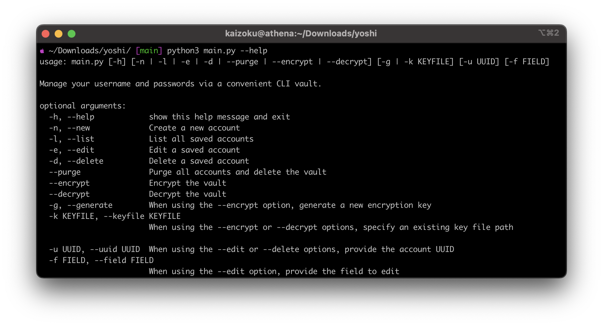
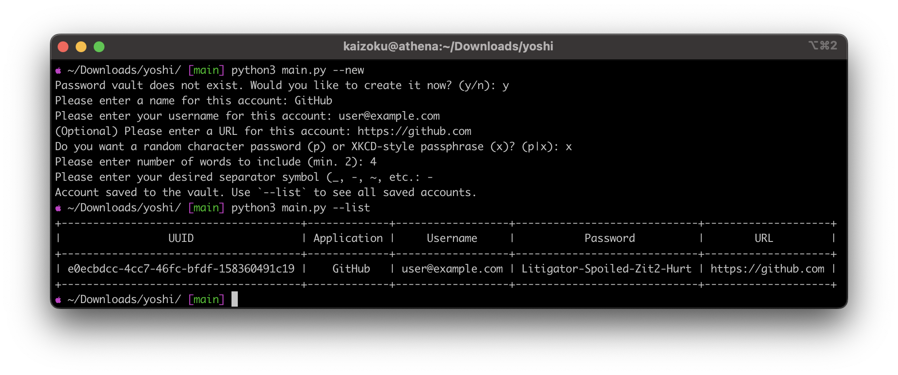

# Yoshi: A Password Manager

A simple command-line pass manager, writtin in Python + SQLite3. This tool
allows you to manage accounts and generate random passwords containing ASCII
letters, numbers, and punctuation (min. 8 characters) or XKCD-like passphrases
(min. 3 words).

Please note that the script is written in Python 3 - you may need to run the
script with the `python3` command instead of `python` if your system uses a
default of Python 2. See the Installation & Usage sections below for more
information.

# Table of Contents

-   [Installation](#installation)
-   [Usage](#usage)
    -   [Arguments](#arguments)
-   [Contributing](#contributing)

# Installation

[(Back to top)](#table-of-contents)

To run the script locally, run the following commands:

```bash
git clone https://github.com/christian-cleberg/yoshi/
```

```bash
cd yoshi
```

```bash
pip3 install -r requirements.txt
```

```bash
python3 main.py --help
```

# Usage

[(Back to top)](#table-of-contents)

All commands can be passed to the program with the following template:  
`python3 main.py <COMMAND> <FLAG> <PARAMETER>`



## Arguments

### Summary

<table>
  <thead>
    <tr>
      <td><b>Argument</b></td>
      <td><b>Shortcut</b></td>
      <td><b>Explanation</b></td>
    </tr>
  </thead>
  <tbody>
    <tr>
      <td>help</td>
      <td>h</td>
      <td>Print the welcome message</td>
    </tr>
    <tr>
      <td>new</td>
      <td>n</td>
      <td>Create a new account</td>
    </tr>
    <tr>
      <td>list</td>
      <td>l</td>
      <td>List all saved accounts</td>
    </tr>
    <tr>
      <td>edit</td>
      <td>e</td>
      <td>Edit a saved account (see below for required flags)</td>
    </tr>
    <tr>
      <td>delete</td>
      <td>d</td>
      <td>Delete a saved account (see below for required flags)</td>
    </tr>
    <tr>
      <td>purge</td>
      <td>N/A</td>
      <td>Purge all accounts and delete the vault</td>
    </tr>
    <tr>
      <td>encrypt</td>
      <td>N/A</td>
      <td>Encrypt the vault database (see below for required flags)</td>
    </tr>
    <tr>
      <td>decrypt</td>
      <td>N/A</td>
      <td>Decrypt the vault database (see below for required flags)</td>
    </tr>
  </tbody>
</table>

#### Flags

Flags for the `edit`, `e` command - both are required:

<table>
  <thead>
    <tr>
      <td><b>Argument</b></td>
      <td><b>Shortcut</b></td>
      <td><b>Explanation</b></td>
    </tr>
  </thead>
  <tbody>
    <tr>
      <td>--uuid</td>
      <td>-u</td>
      <td>Provide the account UUID to edit</td>
    </tr>
    <tr>
      <td>--field</td>
      <td>-f</td>
      <td>Provide the account field to edit</td>
    </tr>
  </tbody>
</table>

Flags for the `delete`, `d` command - this flag is required:

<table>
  <thead>
    <tr>
      <td><b>Argument</b></td>
      <td><b>Shortcut</b></td>
      <td><b>Explanation</b></td>
    </tr>
  </thead>
  <tbody>
    <tr>
      <td>--uuid</td>
      <td>-u</td>
      <td>Provide the account UUID to delete</td>
    </tr>
  </tbody>
</table>

Flags for the `encrypt` or `decrypt` command - you must provide at least one
when encrypting, none are required when decrypting:

<table>
  <thead>
    <tr>
      <td><b>Argument</b></td>
      <td><b>Shortcut</b></td>
      <td><b>Explanation</b></td>
    </tr>
  </thead>
  <tbody>
    <tr>
      <td>--generate</td>
      <td>-g</td>
      <td>When encrypting, generate a new key</td>
    </tr>
    <tr>
      <td>--keyfile</td>
      <td>-k</td>
      <td>When encrypting or decrypting, provide the path to a saved key file</td>
    </tr>
  </tbody>
</table>



# Contributing

[(Back to top)](#table-of-contents)

Any and all contributions are welcome. Feel free to fork the project, add
features, and submit a pull request.
